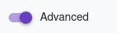
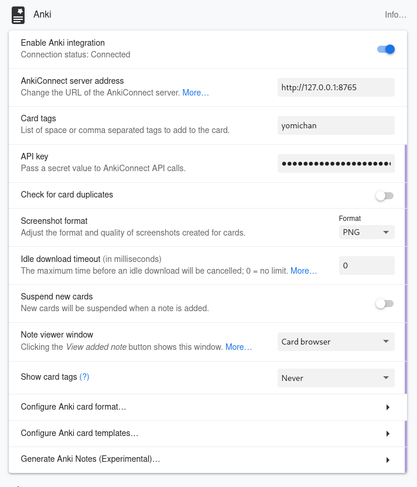
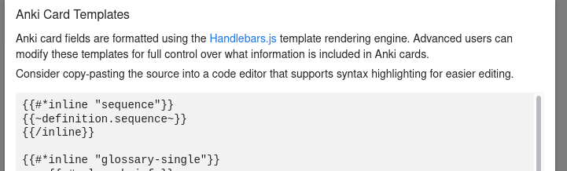
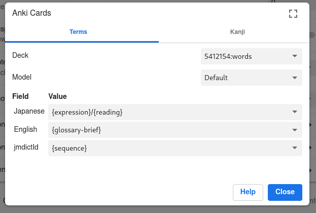

# How to configure renshuu-connect

1. Go to the yomitan addon settings.
2. Enable the advanced mode.

    

3. Scroll to the "Anki" settings section.
    
   1. Enter "http://127.0.0.1:8765" as "AnkiConnect server address".
   2. Enter your Renshuu API key in the "API key" field.
   3. Turn off "Check for card duplicates".
   4. Turn on "Enable Anki integration"

4. Click on "Configure Anki card templates"
    
   1. Paste the following at the beginning of the text box:

    ```
    {{#*inline "sequence"}}
    {{~definition.sequence~}}
    {{/inline}}
    ```
5. Click on "Configure Anki card format…" 
    
    Configure it as shown in the screenshot.
    With the "Deck" setting you can select one of your Renshuu lists that will be used to add new words.
