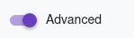
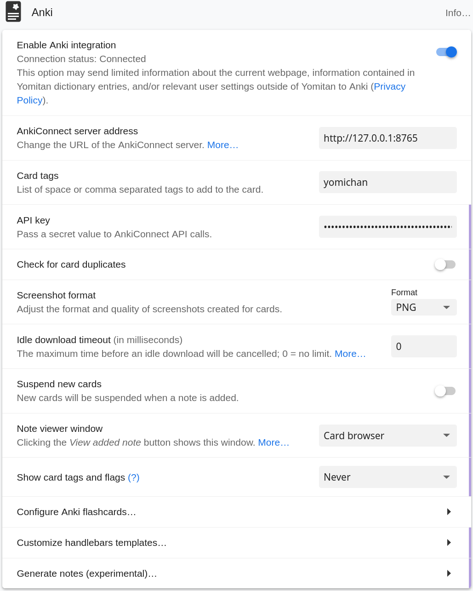
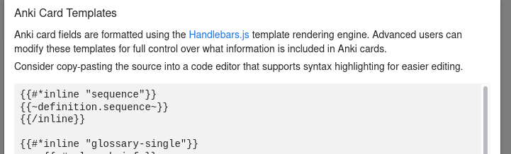
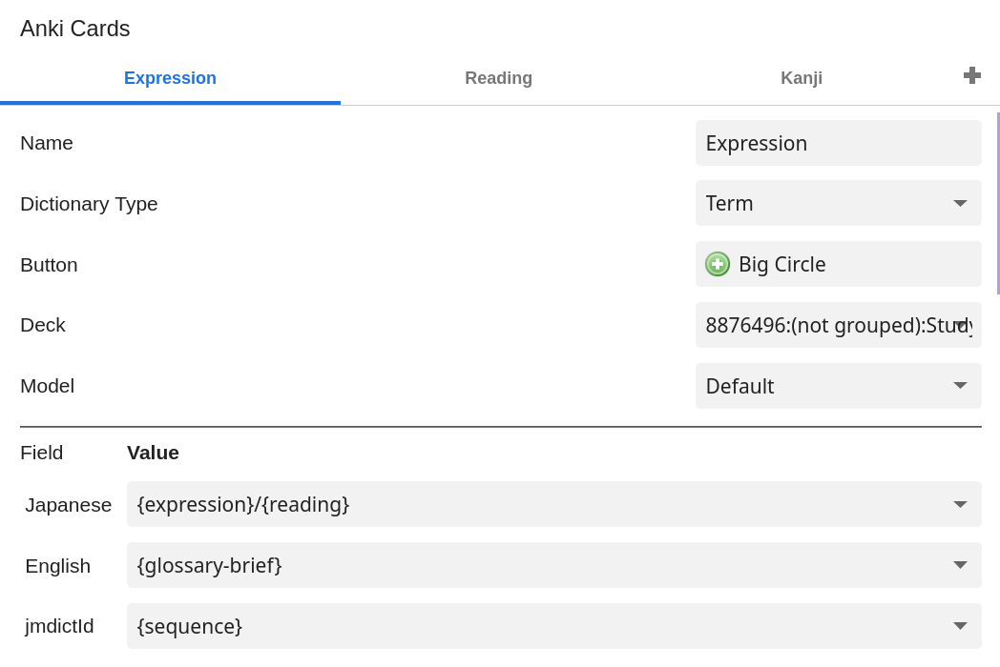
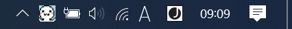
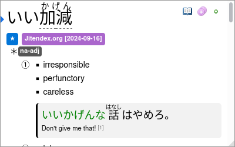
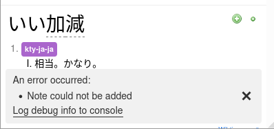

# What is renshuu-connect?

Renshuu-connect is a small utility that makes it possible to take words looked up in the
Yomitan browser addon and add them to a vocabulary list on renshuu.org.

Yomichan already has an interface that is used to add cards to anki decks.
Renshuu-connect provides the same interface. This way yomichan can connect to it
without having to be modified.

# Feedback? Issues?

If you want to contact me about renshuu_connect, you can find me on the renshuu discord server @.ikuto

Using github issues to report problems works too if you already have a github account.

# How to configure renshuu-connect

0. Go to  and download a release for your OS and run it.
1. Go to the yomitan addon settings.
2. Enable the advanced mode (the toggle switch is located at the bottom of the left sidebar).

    

3. Scroll to the "Anki" settings section.
    
   1. Enter "http://127.0.0.1:8765" as "AnkiConnect server address".
   2. Enter your Renshuu API key in the "API key" field. You can find your API Key in Renshuu under Resources > renshuu API (https://www.renshuu.org/index.php?page=misc/api). Make sure to copy the read/write API key.
   3. Turn off "Check for card duplicates".
   4. Turn on "Enable Anki integration"

4. Click on "Customize handlebars templates..."
    
   1. Paste the following at the beginning of the text box:

    ```
    {{#*inline "sequence"}}
    {{~definition.sequence~}}
    {{/inline}}
    ```
5. Click on "Configure Anki flashcards..." 
    
    Configure it as shown in the screenshot.
    With the "Deck" setting you can select one of your Renshuu lists that will be used to add new words.
    Field values:
    - Japanese: {expression}/{reading}
    - English: {glossary-brief}
    - jmdictId: {sequence}

# Common issues

## yomitan shows "Anki connection failure."

Check if renshuu_connect is actually running. It will show a icon in the tray bar nect to the clock when active.



renshuu_connect doesn't automatically start, so it has to be started every time after rebooting. (Autostart might be added at some point)

## I can't select a deck in the yomitan settings

In renshuu you have to create a vocabulary list that will be used for renshuu_connect to add words to. (A list is different from a schedule)

To create a new list go to "Resources" -> "Community Lists" -> "Make a new list" -> "Words" or click this link: [https://www.renshuu.org/index.php?page=custom/list_edit&booktype=vocab&action=new](https://www.renshuu.org/index.php?page=custom/list_edit&booktype=vocab&action=new)

There enter some name for the list and click "save & close".

Then you have to add that list to one of your schedules. For that go back to the "Community Lists" page, select the "Me" tab at the left, find your newly created list and click the button with the green plus symbol. There select one or more schedules.

Words added to the list via yomitan and renshuu_connect will then be automatically also added to the selected schedules.

## yomitan shows an error "Note could not be added"

This usually indicated that renshuu_connect couldn't find the word you were trying to find in the renshuu dictionary.

renshuu_connect uses the dictionary ID sent by yomitan to find a word with the same ID in the renshuu dictionary. This only works when using the Jitendex dictionary (Or the older JMdict dictionary file). Adding entries from other dictionaries like monolingual ones currently doesn't work.

Jitendex entry that was correctly added:



Same word from different dictionary that can't be added:



Support to add words from other dictionaries might be added in the future.
